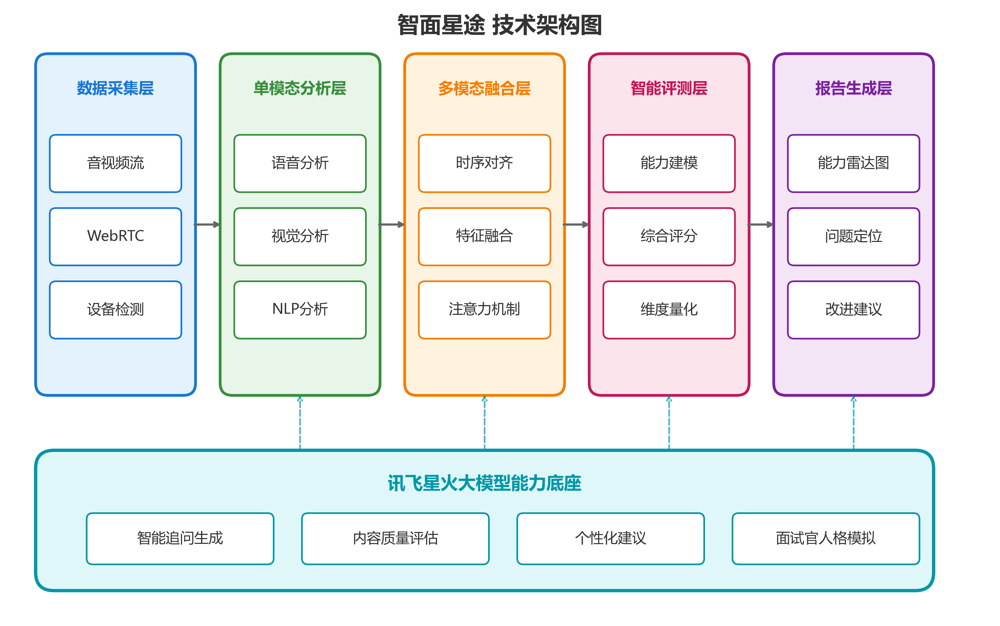

# 图表生成说明

本文件夹包含商业计划书中所有图表的生成代码和导出文件。

## 📁 文件结构

```
图表生成代码/
├── mermaid_charts.md      # Mermaid流程图/架构图代码
├── generate_charts.py     # Python统计图表生成脚本
├── README.md              # 本说明文件
└── 图表/                   # 导出的PNG图表
    ├── 图表6-AI招聘市场规模.png
    ├── 图表7-调研企业规模分布.png
    ├── 图表8-调研企业行业分布.png
    ├── 图表9-行业痛点数据.png
    ├── 图表10-竞品对标雷达图.png
    ├── 图表11-能力评测雷达图.png
    ├── 图表12-三年财务预测.png
    ├── 图表13-面试成本对比.png
    ├── 图表14-效率提升对比.png
    └── 图表15-单位经济模型.png
```

## 🎨 图表类型说明

### Mermaid 图表（流程图/架构图）

| 图表编号 | 名称 | 类型 | 说明 |
|---------|------|------|------|
| 图表1 | 技术架构图 | flowchart | 五层技术架构：采集→分析→融合→评测→报告 |
| 图表2 | 多模态融合示意图 | flowchart | Cross-Modal Attention机制示意 |
| 图表3 | 商业模式图 | flowchart | SaaS订阅+增值服务+C端模式 |
| 图表4 | 团队架构图 | flowchart | 12人团队三组结构 |
| 图表5 | 发展路线图 | gantt/timeline | 2025-2027三年发展规划 |

**使用方法**：
1. 打开 `mermaid_charts.md`
2. 复制对应的Mermaid代码
3. 在 [Mermaid Live Editor](https://mermaid.live/) 中渲染
4. 导出为PNG/SVG格式

### Python 图表（统计图表）

| 图表编号 | 名称 | 类型 | 说明 |
|---------|------|------|------|
| 图表6 | AI招聘市场规模 | 柱状图+折线图 | 2022-2027年市场规模预测 |
| 图表7 | 调研企业规模分布 | 饼图 | 大/中/小型企业占比 |
| 图表8 | 调研企业行业分布 | 饼图 | 互联网/金融/制造/教育占比 |
| 图表9 | 行业痛点数据 | 水平条形图 | 6大痛点调研数据 |
| 图表10 | 竞品对标雷达图 | 雷达图 | 智面星途 vs 竞品能力对比 |
| 图表11 | 能力评测雷达图 | 雷达图 | 候选人能力评测示例 |
| 图表12 | 三年财务预测 | 堆叠柱状图 | 2025-2027营收结构预测 |
| 图表13 | 面试成本对比 | 柱状图 | 人工vs智面星途成本对比 |
| 图表14 | 效率提升对比 | 分组柱状图 | 传统方式vs智面星途效率对比 |
| 图表15 | 单位经济模型 | 柱状图 | CAC/LTV指标展示 |

**使用方法**：
```bash
# 安装依赖
pip install matplotlib numpy

# 运行生成脚本
cd 图表生成代码
python generate_charts.py
```

## 🔧 修改图表

### 修改Mermaid图表
1. 编辑 `mermaid_charts.md` 中对应的代码块
2. 重新在Mermaid Live Editor中渲染导出

### 修改Python图表
1. 编辑 `generate_charts.py` 中对应的函数
2. 修改数据或样式参数
3. 重新运行脚本：`python generate_charts.py`

## 📝 在商业计划书中使用

商业计划书 `商业计划书-智面星途.md` 中已经预留了图表占位符：

```markdown
<!-- 图表1: 技术架构图 -->
<!-- 请参见 图表生成代码/mermaid_charts.md 中的 "图表1: 技术架构图" -->

```

您可以：
1. 使用Mermaid代码在支持的编辑器中直接渲染
2. 或将导出的PNG图片放入`申请材料/图表/`目录供引用

## 🎨 配色方案

| 色系 | 色值 | 用途 |
|------|------|------|
| 蓝色 | `#1976d2` | 技术/数据相关 |
| 绿色 | `#388e3c` | 增长/正向相关 |
| 橙色 | `#f57c00` | 核心/重点相关 |
| 粉色 | `#c2185b` | 评测/警示相关 |
| 青色 | `#0097a7` | 底层/支撑相关 |
| 紫色 | `#7b1fa2` | 输出/报告相关 |

---

*最后更新：2025年12月16日*
