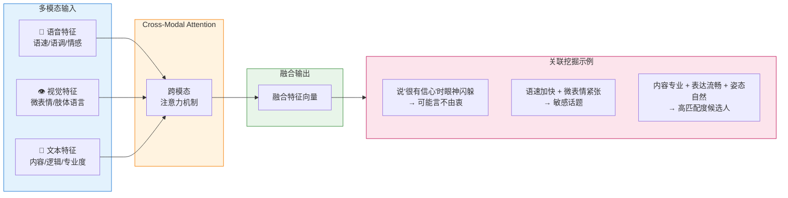
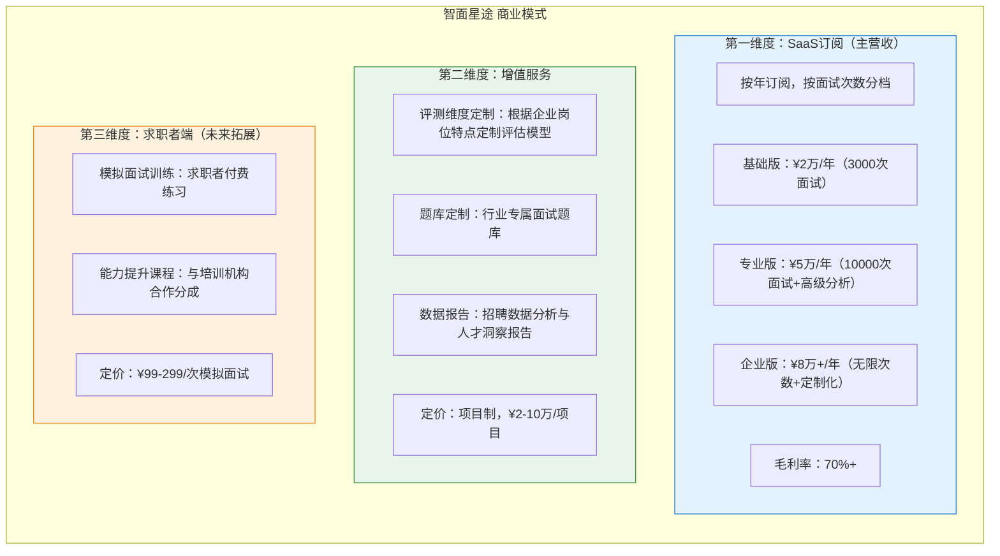
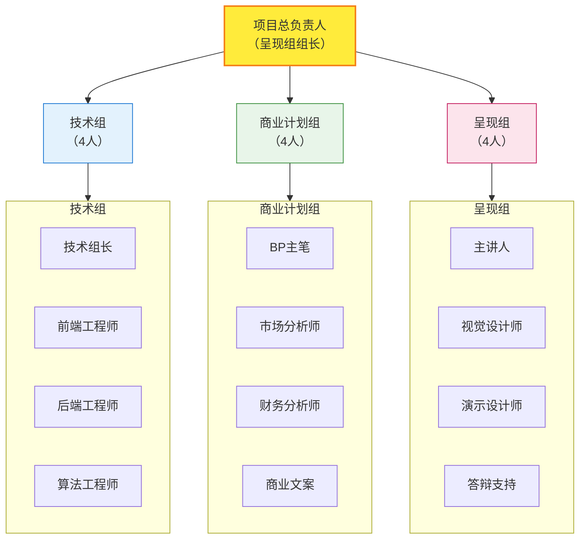
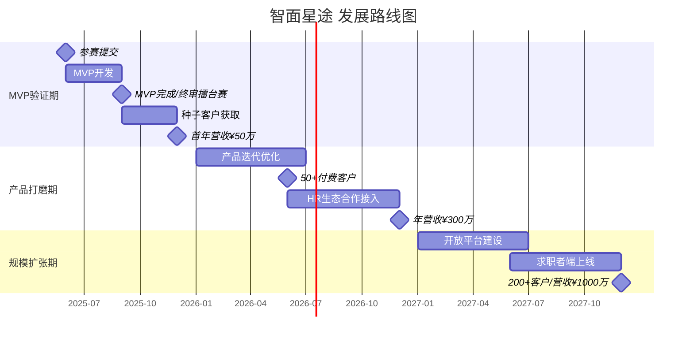
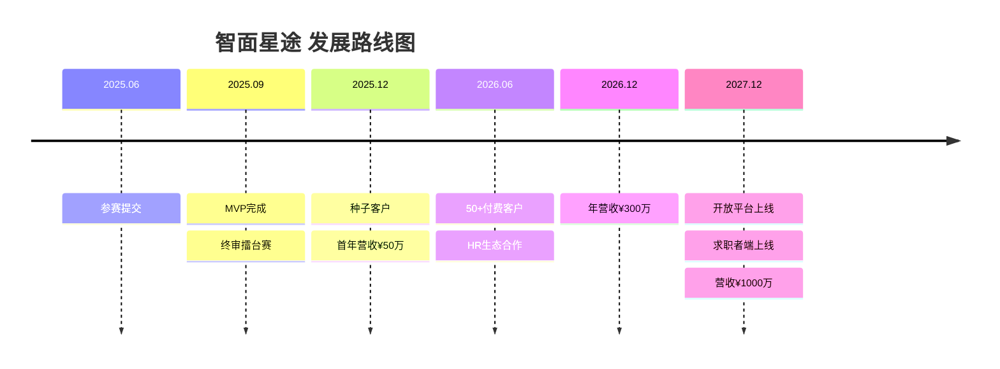

# 智面星途 商业计划书图表 - Mermaid代码

> 本文件包含商业计划书中所有流程图、架构图的Mermaid代码。
> 可以在支持Mermaid的Markdown编辑器中预览，或使用 [Mermaid Live Editor](https://mermaid.live/) 在线渲染导出PNG/SVG。

---

## 图表1: 技术架构图

```mermaid
%%{init: {'theme': 'base', 'themeVariables': { 'fontSize': '16px' }}}%%
block-beta
    columns 5
    
    block:采集层:1
        columns 1
        采集["数据采集层"]
        A1["音视频流"]
        A2["WebRTC"]
        A3["设备检测"]
    end
    
    block:分析层:1
        columns 1
        分析["单模态分析层"]
        B1["语音分析"]
        B2["视觉分析"]
        B3["NLP分析"]
    end
    
    block:融合层:1
        columns 1
        融合["多模态融合层"]
        C1["时序对齐"]
        C2["特征融合"]
        C3["注意力机制"]
    end
    
    block:评测层:1
        columns 1
        评测["智能评测层"]
        D1["能力建模"]
        D2["综合评分"]
        D3["维度量化"]
    end
    
    block:报告层:1
        columns 1
        报告["报告生成层"]
        E1["能力雷达图"]
        E2["问题定位"]
        E3["改进建议"]
    end
    
    采集层 --> 分析层 --> 融合层 --> 评测层 --> 报告层
    
    block:底座:5
        columns 4
        底座标题["讯飞星火大模型能力底座"]
        space
        space
        space
        F1["智能追问"]
        F2["质量评估"]
        F3["个性化建议"]
        F4["人格模拟"]
    end
    
    底座 -- "赋能" --> 分析层
    底座 -- "赋能" --> 融合层
    底座 -- "赋能" --> 评测层
    底座 -- "赋能" --> 报告层

    style 采集层 fill:#e3f2fd,stroke:#1976d2
    style 分析层 fill:#e8f5e9,stroke:#388e3c
    style 融合层 fill:#fff3e0,stroke:#f57c00
    style 评测层 fill:#fce4ec,stroke:#c2185b
    style 报告层 fill:#f3e5f5,stroke:#7b1fa2
    style 底座 fill:#e0f7fa,stroke:#0097a7
```

### 备选方案（flowchart简化版）

```mermaid
%%{init: {'theme': 'base', 'themeVariables': { 'fontSize': '18px' }}}%%
flowchart LR
    subgraph 采集层["📥 数据采集层"]
        A1[音视频流]
        A2[WebRTC]
        A3[设备检测]
    end
    
    subgraph 分析层["🔍 单模态分析层"]
        B1[语音分析]
        B2[视觉分析]
        B3[NLP分析]
    end
    
    subgraph 融合层["🧠 多模态融合层"]
        C1[时序对齐]
        C2[特征融合]
        C3[注意力机制]
    end
    
    subgraph 评测层["📊 智能评测层"]
        D1[能力建模]
        D2[综合评分]
        D3[维度量化]
    end
    
    subgraph 报告层["📋 报告生成层"]
        E1[能力雷达图]
        E2[问题定位]
        E3[改进建议]
    end
    
    采集层 --> 分析层 --> 融合层 --> 评测层 --> 报告层
    
    style 采集层 fill:#e3f2fd,stroke:#1976d2,stroke-width:2px
    style 分析层 fill:#e8f5e9,stroke:#388e3c,stroke-width:2px
    style 融合层 fill:#fff3e0,stroke:#f57c00,stroke-width:2px
    style 评测层 fill:#fce4ec,stroke:#c2185b,stroke-width:2px
    style 报告层 fill:#f3e5f5,stroke:#7b1fa2,stroke-width:2px
```



**讯飞星火大模型能力底座**（单独展示）:
- 智能追问生成 | 内容质量评估 | 个性化建议 | 面试官人格模拟
- 为上述所有层提供 AI 能力支撑

---

## 图表2: 多模态融合示意图



---

## 图表3: 商业模式图



---

## 图表4: 团队架构图



---

## 图表5: 发展路线图



### 时间线版本（备选）



---

## 使用说明

### 方法一：VS Code 预览
1. 安装 VS Code 扩展：`Markdown Preview Mermaid Support`
2. 打开此文件，按 `Ctrl+Shift+V` 预览

### 方法二：在线渲染
1. 访问 [Mermaid Live Editor](https://mermaid.live/)
2. 复制上方任意 Mermaid 代码块
3. 粘贴到编辑器左侧
4. 右侧实时预览，可导出 PNG/SVG

### 方法三：命令行导出
```bash
# 安装 mermaid-cli
npm install -g @mermaid-js/mermaid-cli

# 导出为PNG
mmdc -i mermaid_charts.md -o output.png
```

---

## 配色说明

| 组件 | 颜色 | 含义 |
|------|------|------|
| 蓝色系 | `#e3f2fd` | 技术/数据相关 |
| 绿色系 | `#e8f5e9` | 分析/增长相关 |
| 橙色系 | `#fff3e0` | 核心/融合相关 |
| 粉色系 | `#fce4ec` | 评测/呈现相关 |
| 紫色系 | `#f3e5f5` | 输出/报告相关 |
| 青色系 | `#e0f7fa` | 底层能力/支撑 |

